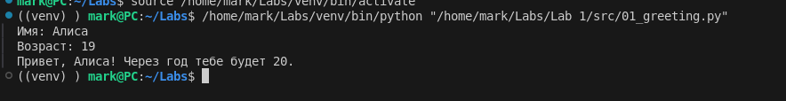
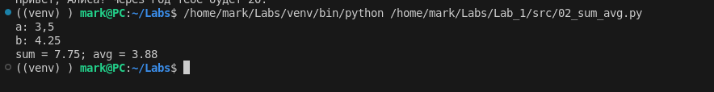
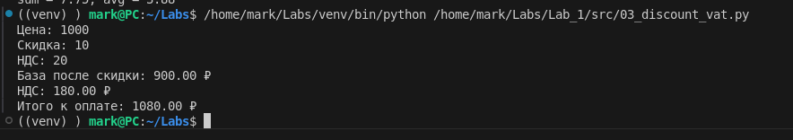
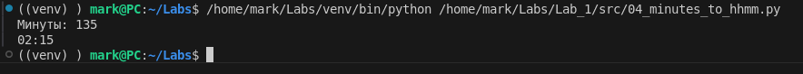
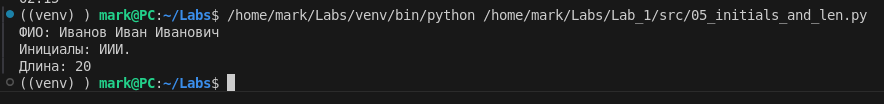
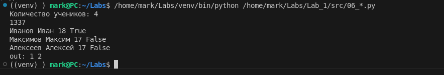
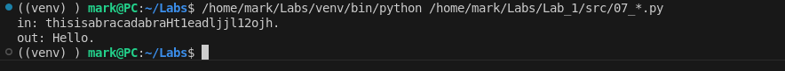

# Лаба 1

Задача 1

```py
name = input("Имя: ")
age = int(input("Возраст: "))

print(f"Привет, {name}! Через год тебе будет {age + 1}.")
```



Задача 2

```py
num1 = float(input("a: ").replace(',', '.'))
num2 = float(input("b: ").replace(',', '.'))

total = num1 + num2
average = total / 2

print(f"sum = {total:.2f}; avg = {average:.2f}")
```



Задача 3

```py
price = float(input("Цена: "))
discount = float(input("Скидка: "))
vat = float(input("НДС: "))

base = price * (1 - discount / 100)
vat_amount = base * (vat / 100)
total = base + vat_amount

print(f"База после скидки: {base:.2f} ₽")
print(f"НДС: {vat_amount:.2f} ₽")
print(f"Итого к оплате: {total:.2f} ₽")
```



Задача 4

```py
minutes = int(input("Минуты: "))

hours = minutes // 60
remaining_minutes = minutes % 60

print(f"{hours:02d}:{remaining_minutes:02d}")
```



Задача 5

```py
fio = input("ФИО: ").strip()

fio_clean = ' '.join(fio.split())

parts = fio_clean.split()
initials = ''.join([part[0].upper() for part in parts])

length = len(fio_clean)

print(f"Инициалы: {initials}.")
print(f"Длина: {length}")
```



Задача 6

```py
n = int(input("Количество учеников: "))

count_offline = 0
count_online = 0

for _ in range(n):
    data = input().split()
    format_type = data[-1]

    if format_type == "True":
        count_offline += 1
    elif format_type == "False":
        count_online += 1

print(f"out: {count_offline} {count_online}")
```



Задача 7

```py
s = input("in: ").strip()

for i in range(len(s)):
    if s[i].isupper():
        start = i
        break

n = len(s)

for k in range(1, n):
    text = ""
    pos = start
    while pos < n:
        text += s[pos]
        pos += k

    if len(text) > 1 and text[-1] == '.':
        second_pos = start + k
        if second_pos > 0 and s[second_pos - 1].isdigit():
            print(f"out: {text}")
            break
```


