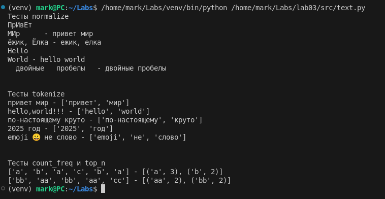
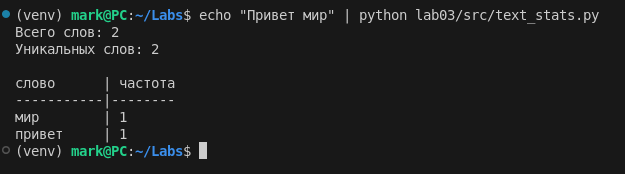

# Лаба 3

Задача 1

```py
import re

print("Тесты normalize")

def normalize(text, *, casefold = True, yo2e = True):
    text = re.sub(r"[\t\r\n\f\v]", " ", text)

    if yo2e:
        text = text.replace("ё", "е").replace("Ё", "Е")

    if casefold:
        text = text.casefold()

    text = re.sub(r" +", " ", text)

    return text.strip()

tests = [
    "ПрИвЕт\nМИр\t",
    "ёжик, Ёлка",
    "Hello\r\nWorld",
    "  двойные   пробелы  "
]

for array in tests:
    result = normalize(array)
    print(f"{array} - {result}")

print("\n")


print("Тесты tokenize")

def tokenize(text):
    pattern = r"\b[\w]+(?:-[\w]+)*\b"
    return re.findall(pattern, text)

tests = [
    "привет мир",
    "hello,world!!!",
    "по-настоящему круто",
    "2025 год",
    "emoji 😀 не слово"
]

for array in tests:
    result = tokenize(array)
    print(f"{array} - {result}")

print("\n")


print("Тесты count_freq и top_n")

def count_freq(tokens):
    freq = {}
    for token in tokens:
        freq[token] = freq.get(token, 0) + 1
    return freq

def top_n(freq, n = 2):
    sorted_items = sorted(freq.items(), key=lambda x: (-x[1], x[0]))
    return sorted_items[:n]

tests = [
    ["a", "b", "a", "c", "b", "a"],
    ["bb", "aa", "bb", "aa", "cc"]
]

for array in tests:
    result = top_n(count_freq((array)))
    print(f"{array} - {result}")
```



Задача 2

```py
import sys
import os

sys.path.insert(0, os.path.dirname(os.path.dirname(os.path.dirname(__file__))))

from lib.text import normalize, tokenize, count_freq, top_n


def main():
    text = sys.stdin.read().strip()

    normalized_text = normalize(text)
    tokens = tokenize(normalized_text)
    freq = count_freq(tokens)
    top_words = top_n(freq, 5)

    print(f"Всего слов: {len(tokens)}")
    print(f"Уникальных слов: {len(freq)}")

    if top_words:
        max_word_len = max(len(word) for word, _ in top_words)
        col_width = max(max_word_len, 10)

        print(f"\n{'слово':<{col_width}} | частота")
        print("-" * col_width + "-|--------")

        for word, count in top_words:
            print(f"{word:<{col_width}} | {count}")


if __name__ == "__main__":
    main()
```


