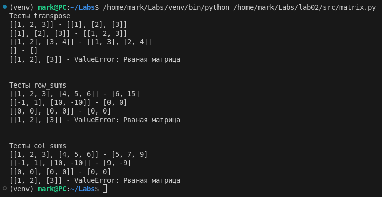
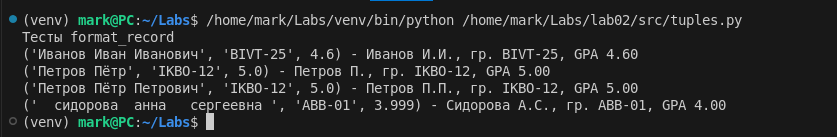

# Лаба 2

Задача 1

```py
print("Тесты min_max")
def min_max(nums):
    if not nums:
        raise ValueError("Список пуст — невозможно определить минимум и максимум.")

    min_val = max_val = nums[0]
    for n in nums[1:]:
        if n < min_val:
            min_val = n
        elif n > max_val:
            max_val = n
    return (min_val, max_val)

tests = [
    [3, -1, 5, 5, 0],
    [42],
    [-5, -2, -9],
    [],
    [1.5, 2, 2.0, -3.1]
]

for array in tests:
    try:
        result = min_max(array)
        print(f"{array} - {result}")
    except ValueError as e:
        print(f"{array} - ValueError: {e}")

print("\n")


print("Тесты unique_sorted")

def unique_sorted(nums):
    unique = []
    for n in nums:
        exists = False
        for u in unique:
            if n == u:
                exists = True
                break
        if not exists:
            unique.append(n)

    n = len(unique)
    for i in range(n - 1):
        for j in range(0, n - i - 1):
            if unique[j] > unique[j + 1]:
                unique[j], unique[j + 1] = unique[j + 1], unique[j]

    return unique

tests = [
    [3, 1, 2, 1, 3],
    [],
    [-1, -1, 0, 2, 2],
    [1.0, 1, 2.5, 2.5, 0],
]

for array in tests:
    try:
        result = unique_sorted(array)
        print(f"{array} - {result}")
    except ValueError as e:
        print(f"{array} - ValueError: {e}")

print("\n")


print("Тесты flatten")

def flatten(mat):
    for row in mat:
        if type(row) not in (list, tuple):
            raise TypeError("Все элементы матрицы должны быть списками или кортежами.")

    result = []
    for row in mat:
        for el in row:
            result += [el]
    return result

tests = [
    [[1, 2], [3, 4]],
    [[1, 2], (3, 4, 5)],
    [[1], [], [2, 3]],
    [[1, 2], "ab"],
]

for array in tests:
    try:
        result = flatten(array)
        print(f"{array} - {result}")
    except TypeError as e:
        print(f"{array} - TypeError: {e}")
```


Задача 2

```py
def isTorn(mat):
    row_length = len(mat[0])
    for i in range(len(mat)):
        if len(mat[i]) != row_length:
            raise ValueError("Рваная матрица")


print("Тесты transpose")


def transpose(mat):
    if not mat:
        return []

    isTorn(mat)

    result = []
    for i in range(len(mat[0])):
        new_row = []
        for j in range(len(mat)):
            new_row.append(mat[j][i])
        result.append(new_row)

    return result


tests = [
    [[1, 2, 3]],
    [[1], [2], [3]],
    [[1, 2], [3, 4]],
    [],
    [[1, 2], [3]]
]

for array in tests:
    try:
        result = transpose(array)
        print(f"{array} - {result}")
    except ValueError as e:
        print(f"{array} - ValueError: {e}")

print("\n")


print("Тесты row_sums")


def row_sums(mat):
    if not mat:
        return []

    isTorn(mat)

    result = []
    for i in range(len(mat)):
        row_sum = 0
        for j in range(len(mat[i])):
            row_sum += mat[i][j]
        result.append(row_sum)

    return result


tests = [
    [[1, 2, 3], [4, 5, 6]],
    [[-1, 1], [10, -10]],
    [[0, 0], [0, 0]],
    [[1, 2], [3]]
]

for array in tests:
    try:
        result = row_sums(array)
        print(f"{array} - {result}")
    except ValueError as e:
        print(f"{array} - ValueError: {e}")

print("\n")


print("Тесты col_sums")


def col_sums(mat):
    if not mat:
        return []

    isTorn(mat)

    result = []
    for j in range(len(mat[0])):
        col_sum = 0
        for i in range(len(mat)):
            col_sum += mat[i][j]
        result.append(col_sum)

    return result


tests = [
    [[1, 2, 3], [4, 5, 6]],
    [[-1, 1], [10, -10]],
    [[0, 0], [0, 0]],
    [[1, 2], [3]]
]

for array in tests:
    try:
        result = col_sums(array)
        print(f"{array} - {result}")
    except ValueError as e:
        print(f"{array} - ValueError: {e}")
```



Задача 3

```py
print("Тесты format_record")


def format_record(rec):
    if not isinstance(rec, tuple) or len(rec) != 3:
        raise TypeError("Запись должна быть кортежем из 3 элементов")

    fio, group, gpa = rec

    if not isinstance(fio, str):
        raise TypeError("ФИО должно быть строкой")
    if not isinstance(group, str):
        raise TypeError("Группа должна быть строкой")
    if not isinstance(gpa, (int, float)):
        raise TypeError("GPA должно быть числом")

    if not fio.strip():
        raise ValueError("ФИО не может быть пустым")
    if not group.strip():
        raise ValueError("Группа не может быть пустой")

    fio_parts = fio.split()

    surname = fio_parts[0].capitalize()

    initials = []
    for i in range(1, min(3, len(fio_parts))):
        name_part = fio_parts[i]
        if name_part:
            initial = name_part[0].upper() + "."
            initials.append(initial)

    formatted_fio = surname
    formatted_fio += " " + "".join(initials)

    formatted_group = group.strip()

    formatted_gpa = f"{gpa:.2f}"

    return f"{formatted_fio}, гр. {formatted_group}, GPA {formatted_gpa}"


tests = [
    ("Иванов Иван Иванович", "BIVT-25", 4.6),
    ("Петров Пётр", "IKBO-12", 5.0),
    ("Петров Пётр Петрович", "IKBO-12", 5.0),
    ("  сидорова  анна   сергеевна ", "ABB-01", 3.999),
]

for array in tests:
    try:
        result = format_record(array)
        print(f"{array} - {result}")
    except ValueError as e:
        print(f"{array} - ValueError: {e}")
```


