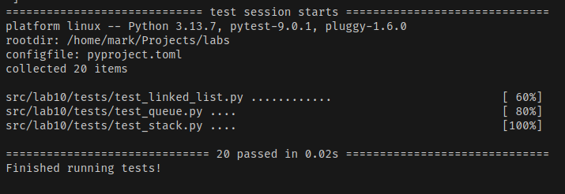

# Лаба 10

**Stack**

```py
class Stack:
    def __init__(self) -> None:
        self._data = []

    def push(self, item) -> None:
        self._data.append(item)

    def pop(self):
        if not self._data:
            raise IndexError("pop from empty Stack")
        return self._data.pop()

    def peek(self):
        return self._data[-1] if self._data else None

    def is_empty(self) -> bool:
        return not self._data

    def __len__(self) -> int:
        return len(self._data)
```

**Queue**

```py
class Queue:
    def __init__(self) -> None:
        self._data = deque()

    def enqueue(self, item) -> None:
        self._data.append(item)

    def dequeue(self):
        if not self._data:
            raise IndexError("dequeue from empty Queue")
        return self._data.popleft()

    def peek(self):
        return self._data[0] if self._data else None

    def is_empty(self) -> bool:
        return not self._data

    def __len__(self) -> int:
        return len(self._data)
```

**Node**

```py
class Node:
    def __init__(self, value, next=None) -> None:
        self.value = value
        self.next = next

```

**SinglyLinkedList**

```py
class SinglyLinkedList:
    def __init__(self) -> None:
        self.head = None
        self.tail = None
        self._size = 0

    def append(self, value) -> None:
        new = Node(value)
        if self.head is None:
            self.head = self.tail = new
        else:
            assert self.tail is not None
            self.tail.next = new
            self.tail = new
        self._size += 1

    def prepend(self, value) -> None:
        new = Node(value, next=self.head)
        self.head = new
        if self.tail is None:
            self.tail = new
        self._size += 1

    def insert(self, idx: int, value) -> None:
        if not (0 <= idx <= self._size):
            raise IndexError("index out of range")

        if idx == 0:
            return self.prepend(value)

        if idx == self._size:
            return self.append(value)

        prev = self.head
        for _ in range(idx - 1):
            assert prev is not None
            prev = prev.next

        new = Node(value, next=prev.next)
        prev.next = new
        self._size += 1

    def remove_at(self, idx: int) -> None:
        if not (0 <= idx < self._size):
            raise IndexError("index out of range")

        if idx == 0:
            removed = self.head
            self.head = removed.next
            if self._size == 1:
                self.tail = None
            self._size -= 1
            return

        prev = self.head
        for _ in range(idx - 1):
            prev = prev.next

        removed = prev.next
        prev.next = removed.next
        if removed is self.tail:
            self.tail = prev

        self._size -= 1

    def __iter__(self):
        current = self.head
        while current:
            yield current.value
            current = current.next

    def __len__(self) -> int:
        return self._size

    def __repr__(self) -> str:
        return f"SinglyLinkedList([{', '.join(repr(v) for v in self)}])"

    def pretty(self) -> str:
        parts = []
        current = self.head
        while current:
            parts.append(f"[{current.value}]")
            current = current.next
        parts.append("None")
        return " -> ".join(parts)

```

Тесты

